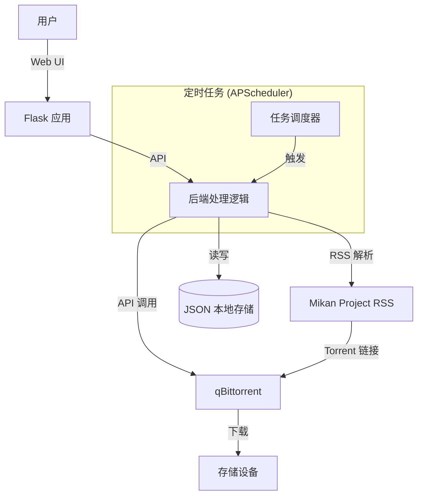

# MikanDown

[](https://www.python.org/downloads/)
[](https://opensource.org/licenses/MIT)
[](https://www.docker.com/)

> **MikanDown** 是一个基于 Web 的自动化番剧下载管理器。它通过解析 Mikan Project 的 RSS 订阅源，结合灵活的关键词过滤规则，自动将任务提交至 qBittorrent 进行下载。专为追番爱好者打造，实现“一站式”自动追更。

## ✨ 特性

- **🚀 自动化追更**：支持定时任务，自动检查 RSS 更新并下载，从此不再错过任何一集。
- **🎯 精准过滤**：支持全局及单个订阅的关键词包含/排除规则，精准控制下载内容（如指定字幕组、分辨率）。
- **🔒 安全可靠**：内置用户认证系统，支持密码哈希存储；敏感配置本地保存，不上传云端。
- **🐳 Docker 支持**：提供 Docker 镜像及 Docker Compose 配置，一键部署，开箱即用。
- **📦 qBittorrent 集成**：深度集成 qBittorrent API，自动分类、自动设置保存路径，便于媒体库整理。
- **🔍 历史记录**：自动记录已下载条目，防止重复下载。
- **🌐 代理支持**：内置代理配置，轻松应对网络访问限制。

## 🏗️ 架构概览



## 🚀 快速开始

### 方法一：Docker 部署 (推荐)

最简单的方式，无需配置 Python 环境。

1. **拉取镜像**
   ```bash
   docker pull hertmoon/mikandown
   ```

2. **创建 `docker-compose.yml`**
   ```yaml
   version: '3'
   services:
     mikandown:
       image: hertmoon/mikandown
       container_name: mikandown
       ports:
         - "5999:5000"
       volumes:
         - ./data:/app/data
       restart: unless-stopped
   ```

3. **启动服务**
   ```bash
   docker-compose up -d
   ```

4. **访问**
   打开浏览器访问 `http://localhost:5999`，按指引完成初始化设置。

### 方法二：源码运行

适合开发者或需要自定义环境的用户。

1. **克隆项目**
   ```bash
   git clone https://github.com/764475881/MikanDown.git
   cd MikanDown
   ```

2. **安装依赖**
   ```bash
   pip install -r requirements.txt
   ```

3. **运行程序**
   ```bash
   python main.py
   ```

4. **访问**
   打开浏览器访问 `http://localhost:5000`。

## ⚙️ 配置说明

首次运行后，系统会引导你创建管理员账户。之后可在 Web 界面进行以下配置：

- **RSS 订阅管理**：添加、删除 Mikan 的 RSS 链接。
- **全局过滤器**：设置全局生效的包含/排除关键词。
- **qBittorrent 设置**：配置 qBittorrent 的连接信息（Host, Port, 用户名，密码）及基础保存路径。
- **代理设置**：如需访问 Mikan，可在此配置 HTTP/HTTPS 代理。

**注意**：所有配置数据均保存在 `data/config.json` 中，本地存储，安全无忧。

## 🛣️ 开发路线图 (Roadmap)

本项目正在持续开发中，未来计划包括：

- [ ] **多下载器支持**：兼容 Transmission, Aria2 等更多下载工具。
- [ ] **通知系统**：集成 Telegram, Discord, PushPlus 等通知方式。
- [ ] **元数据增强**：自动从 Bangumi 获取番剧封面、简介、评分等信息。
- [ ] **高级过滤**：支持正则表达式、文件大小范围、分辨率识别。
- [ ] **前端重构**：升级为 Vue3/React 前后端分离架构，提供更佳交互体验。
- [ ] **缺集检测**：智能分析并补全缺失剧集。

## 🤝 贡献

欢迎提交 Issue 和 Pull Request！

## 📄 许可证

本项目采用 MIT 许可证。详见 [LICENSE](LICENSE) 文件。

---

*Made with ❤️ for Anime Lovers*
